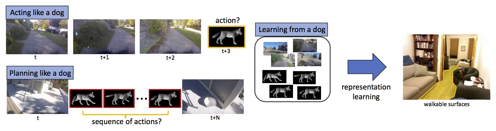
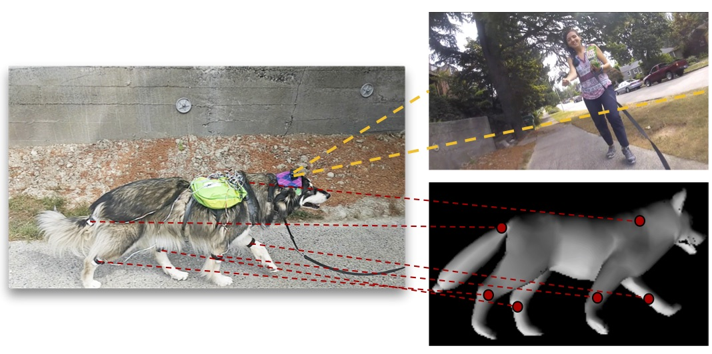

## [Who Let The Dogs Out? Modeling Dog Behavior From Visual Data](https://arxiv.org/pdf/1803.10827.pdf)
By Kiana Ehsani, Hessam Bagherinezhad, Joseph Redmon, Roozbeh Mottaghi, and Ali Farhadi

### Abstract

Dogs are intelligent. Let's learn from them! We introduce DECADE, a dataset of ego-centric videos from a dog’s perspective as well as her corresponding movements.
In this paper we propose a model that can
1. Learn to act like a dog (predicting the dog’s future moves),
2. Learn to plan like a dog (estimating a sequence of movements that take the state of the dog’s world from what is observed at a given time to a desired observed state),
3. Learn from a dog (exploring the potentials of using the dog's movements for representation learning).

This project is presented as poster in CVPR'18.

### Citing This Work

If you find this project useful in your research, please consider citing:

	@inproceedings{ehsani2018dog,
	    author = {Ehsani, Kiana and Bagherinezhad, Hessam and Redmon, Joseph and Mottaghi, Roozbeh and Farhadi, Ali},
	    title = {Who Let The Dogs Out? Modeling Dog Behavior From Visual Data},
	    booktitle = {CVPR},	    
	    year = {2018}
	}

### Dataset

We introduce DECADE, a dataset of ego-centric dog
video and joint movements. The dataset includes 380 video
clips from a camera mounted on the dog’s head. It also includes
corresponding information about body position and
movement. Overall we have 24500 frames. We use 21000
of them for training, 1500 for validation, and 2000 for testing.
Train, validation, and test splits consist of disjoint
video clips.

We use a GoPro camera on the dog’s head to capture the
ego-centric videos and sub-sample frames at the rate of 5
fps. An Arduino on the dog’s back connects to the IMUs and
records the positional information. It also collects audio
data via a microphone mounted on the dog’s back. We synchronize
the GoPro with the IMU measurements using audio
information.

The dataset can be downloaded from [here](https://homes.cs.washington.edu/~kianae/DECADE.zip).

### Running the code

#### Requirements

This source code is implemented using PyTorch framework (v.0.2.0_3). For installing the framework and its prerequisites visit [PyTorch official website](http://pytorch.org/).

#### Installation
 
1. Clone the repository using the command

		git clone https://github.com/ehsanik/dogTorch
		cd dogTorch

3. Download the dataset from [here](https://homes.cs.washington.edu/~kianae/DECADE.zip) and unzip it.
2. Make a link to the dataset.

		ln -s /PATH/TO/DATASET data

3. Download the pretrained weights from [here](https://homes.cs.washington.edu/~kianae/weights_dog_cvpr18.zip) and unzip it.

#### Acting like a dog

We predict how the dog acts in the visual world in response to various situations. Specifically, we model the future actions of the dog given a sequence of previously seen images. To reproduce the results in the paper:

<table>
<tr>
<th class="tg-us36">Model</th>
<th class="tg-us36">Test Accuracy</th>
<th class="tg-us36">Perplexity</th>
<th class="tg-us36">Angular metric</th>
<th class="tg-us36">All joints</th>
</tr>
<tr>
<td class="tg-us36">CNN (Baseline)</td>
<td class="tg-us36">19.84</td>
<td class="tg-us36">0.2171</td>
<td class="tg-us36">63.42</td>
<td class="tg-us36">8.67</td>
</tr>
<tr>
<td class="tg-us36">Ours</td>
<td class="tg-us36">21.62</td>
<td class="tg-us36">0.2514</td>
<td class="tg-us36">59.61</td>
<td class="tg-us36">9.49</td>
</tr>
</table>

1. To test the network using pretrained models:

		python3 main.py --arch LstmImg2LastImus --read_features --input_length 5 --sequence_length 10 --output_length 5 --dataset DogClipDataset --features_dir data/new_features --use_test_for_val test --reload /PATH/TO/WEIGHTS/lstm-pred-5-to-5.pytar --image_feature 1024

2. To train the network:

		python3 main.py --arch LstmImg2LastImus --read_features --input_length 5 --sequence_length 10 --output_length 5 --dataset DogClipDataset --features_dir data/new_features --image_feature 1024

#### Planning like a dog

In this part we model how dogs plan actions to accomplish a task. To achieve this, we design a task as follows: Given a pair of non-consecutive image frames, plan a sequence of joint movements that the dog would take to get from the first frame (starting state) to the second frame (ending
state). To reproduce the results in the paper:

<table class="tg">
<tr>
<th class="tg-us36">Model</th>
<th class="tg-us36">Test Accuracy</th>
<th class="tg-us36">Perplexity</th>
<th class="tg-us36">Angular metric</th>
<th class="tg-us36">All joints</th>
</tr>
<tr>
<td class="tg-us36">CNN(Baseline)</td>
<td class="tg-us36">14.61</td>
<td class="tg-us36">0.1419</td>
<td class="tg-us36">76.18</td>
<td class="tg-us36">0.14</td>
</tr>
<tr>
<td class="tg-us36">Ours</td>
<td class="tg-us36">19.77</td>
<td class="tg-us36">0.2362</td>
<td class="tg-us36">63.14</td>
<td class="tg-us36">3.66</td>
</tr>
</table>

1. To test the network using pretrained models:

		python3 main.py --arch LstmImg2ActionPlanning --read_features --planning_distance 5 --sequence_length 7 --output_length 5 --features_dir data/new_features --single_image_feature --image_feature 512 --use_test_for_val test --reload /PATH/TO/WEIGHTS/lstm-plan-5.pytar

2. To train the network:

		python3 main.py --arch LstmImg2ActionPlanning --read_features --planning_distance 5 --sequence_length 7 --output_length 5 --features_dir data/new_features --single_image_feature --image_feature 512 

#### Learning from a dog

To obtain the representation, we train a ResNet-18 model to estimate the dog movements from time t − 1 to time t by looking at the images at time t − 1 and t. We use a simple Siamese network with two ResNet-18 towers whose weights are shared.

To test the network:

	python3 main.py test --arch FullyConvolutional --output_length 1 --sequence_length 1 --dataset NyuDataset --data data/nyu --no-strict --reload cnn_5_5_best_features.pytar --use_test_for_val --reload /PATH/TO/WEIGHTS/walkable.pytar

### Press Coverage

&nbsp;

&nbsp;

&nbsp;

&nbsp;

&nbsp;

&nbsp;

&nbsp;
